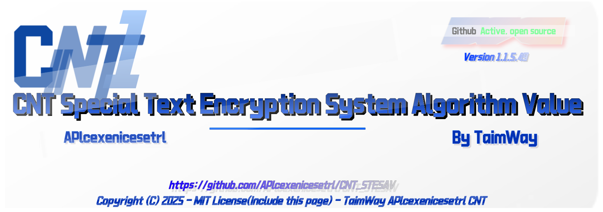

<h1>CNT STESAV</h1>
一种用于保护 CNT 数据的加密算法。  
 

     

[**English**](./readme.md) | [**中文简体**](./Readme(zh-cn).md)

---

# 介绍

### **欢迎来到「CNT STESAV」**

CNT STESAV 名为 "CNT Special Text Encryption System Algorithm Value"，中文名为 「特殊性文本加密系统算法值」。

这是一个系统算法，用于针对 CNT 系列的数据保护，而且这种数据保护算法是公开的，但禁止逆向破坏非开源算法。

### **警告**

CNT STESAV 由 TaimWay 独自开发，为 CNT 系列提供加密算法，

本算法在一定的程度上，部分算法将公开使用。

本算法为 MIT 许可，任何人可以使用，转发，（二次）更改STESAV算法。

### **许可**

<a href="https://github.com/APlcexenicesetrl/CNT_STESAV/blob/main/LICENSE">MIT 许可</a>，允许使用、查看、修改
